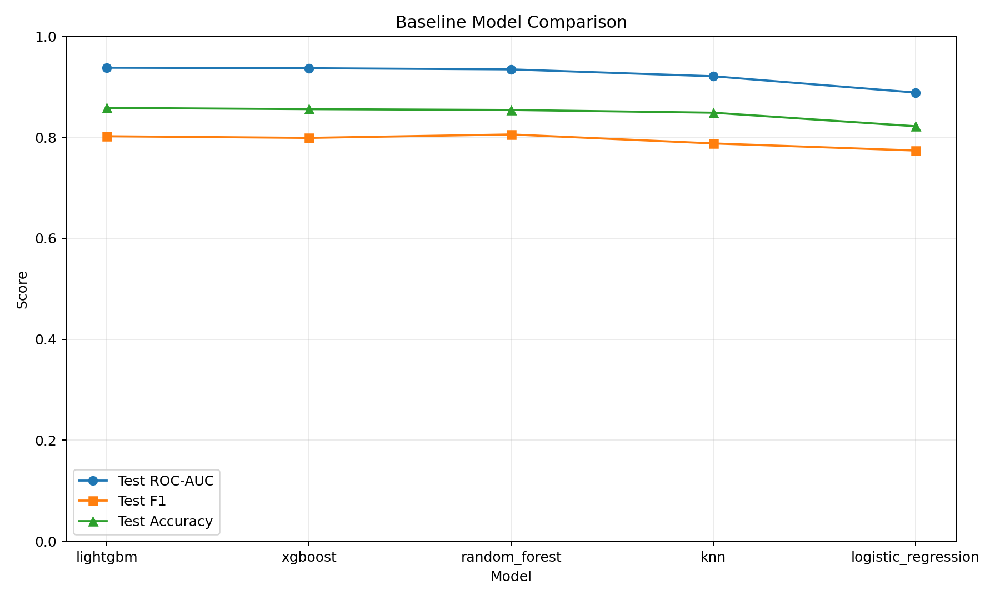
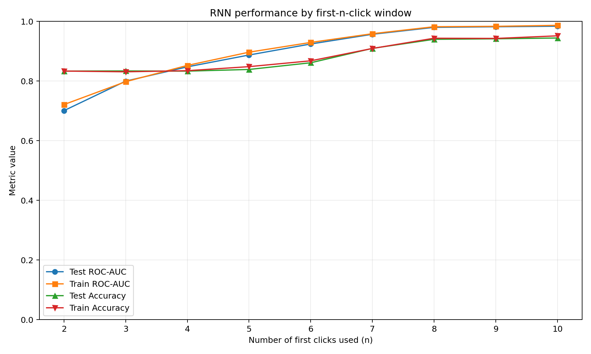

# Online Shopping ML Prediction by SKU YOU LATER

End-to-end ML pipeline to predict purchase intent from online retail sessions.

## Project Flow

This repository follows a clear progression from raw clickstream data to deployed inference:

1. Data ingestion and preprocessing
2. Feature engineering (first-N and full-session)
3. Label generation (proxy, manual, or cluster-derived)
4. Session clustering and labeling support
5. Model training (baseline, bagging, stacking, RNN)
6. Evaluation, reports, and figures
7. Demo inference API + storefront UI

## Team Setup

This project uses a local virtual environment (`.venv`) managed by `uv`.
Do not rely on globally installed Python tools (for example `ruff`, `pytest`).

### Prerequisites

- Python 3.11
- `uv`
- Optional: Conda (for bootstrap via `environment.yml`)

### Bootstrap (Option A: with Conda)

```bash
conda env create -f environment.yml
conda activate online_shopping_ml_prediction_by_sku_you_later
```

### Create and sync project environment

```bash
make create_environment
source .venv/bin/activate
```

If `.venv` already exists, use:

```bash
make sync
```

## Common Commands

```bash
make help        # list available targets
make sync        # sync dependencies from pyproject + uv.lock
make lint        # ruff format check + lint
make format      # auto-fix lint and format
make test        # run pytest
make lock        # refresh uv.lock
make data        # run dataset pipeline entrypoint
make clean       # remove Python cache artifacts
make cluster_ui  # run Streamlit cluster labeling app
make api         # run FastAPI demo inference API
make demo_ui     # run React storefront demo
```

## Data Ingestion and Dataset Pipeline

The dataset entrypoint is `online_retail_prediction/dataset.py` and is wired to:

```bash
make data
```

This is the initial step before feature engineering and labeling.

## Feature Engineering

Session-level feature construction (first-N and full-session) and label creation are handled via:

```bash
uv run python -m online_retail_prediction.features
```

Docs:

- `docs/FEATURE_ENGINEERING.md`
- `docs/LABELING.md`

Outputs:

- `data/processed/features_first_n.csv`
- `data/processed/features_full_session.csv`
- `data/processed/baseline_labels.csv`

## Cluster Labeling Workflow

Clustering is used to summarize sessions and scale intent labeling:

- `docs/CLUSTER_LABELING.md`
- `docs/STREAMLIT_CLUSTER_LABELING_UI.md`

Run the labeling UI:

```bash
make cluster_ui
```

Key outputs:

- `data/cluster_outputs/cluster_assignments.csv`
- `data/cluster_outputs/cluster_label.csv`
- `data/cluster_outputs/cluster_interpretations.csv`
- `data/cluster_outputs/selected_features.json`

### Clustering Metrics (from `models/clustering_metrics.json`)

- k: 8
- Sessions: 24,026
- Features used: 17
- Inertia: 214,544.2956
- Silhouette: 0.1696
- Calinski-Harabasz: 3,100.9500
- Davies-Bouldin: 1.8167
- Largest cluster share: 21.24%

## Modeling

Modeling lives under `online_retail_prediction/modeling/`. The project includes baseline,
bagging, stacking, and RNN approaches.

### Baseline Models

Train baselines:

```bash
uv run python -m online_retail_prediction.modeling.baseline_train
```

Baseline metrics (from `models/`):

- Logistic Regression (`models/baseline_model_metrics.txt`): Accuracy 0.7528, F1 0.5619, ROC-AUC 0.8913
- Random Forest (`models/baseline_rf_model_metrics.txt`): Accuracy 0.7834, F1 0.5814, ROC-AUC 0.8920

Baseline comparison across additional models is captured in `reports/model_comparison_baseline.csv`
and visualized in `reports/figures/model_comparison_baseline.png`.



| model               |   test_accuracy |   test_precision |   test_recall |   test_f1 |   test_roc_auc |
|:--------------------|----------------:|-----------------:|--------------:|----------:|---------------:|
| lightgbm            |        0.858302 |         0.827834 |      0.777903 |  0.802092 |       0.937904 |
| xgboost             |        0.855805 |         0.823459 |      0.775648 |  0.798839 |       0.936927 |
| random_forest       |        0.854141 |         0.792690 |      0.819053 |  0.805656 |       0.934550 |
| knn                 |        0.848731 |         0.816697 |      0.760992 |  0.787861 |       0.920918 |
| logistic_regression |        0.821889 |         0.728358 |      0.825254 |  0.773784 |       0.888654 |

### Bagging Model Training

Train and fine-tune bagging classifiers (base estimators: logistic regression, decision tree, and KNN)
using processed features and cluster-derived intent labels:

```bash
uv run python -m online_retail_prediction.modeling.bagging_train
```

Optional arguments:

```bash
uv run python -m online_retail_prediction.modeling.bagging_train \
  --features-path data/processed/features_first_n.csv \
  --cluster-assignments-path data/cluster_outputs/cluster_assignments.csv \
  --cluster-labels-path data/cluster_outputs/cluster_label.csv \
  --output-dir models \
  --test-size 0.2 \
  --cv 5 \
  --random-state 42
```

Outputs are written to `models/`:

- `bagging_logistic_regression.pkl` + `bagging_logistic_regression_metrics.txt`
- `bagging_decision_tree.pkl` + `bagging_decision_tree_metrics.txt`
- `bagging_knn.pkl` + `bagging_knn_metrics.txt`
- `bagging_model_comparison.csv`

Bagging comparison (from `models/bagging_model_comparison.csv`):

| model                       |   test_accuracy |   test_precision |   test_recall |   test_f1 |   test_roc_auc |
|:----------------------------|----------------:|-----------------:|--------------:|----------:|---------------:|
| bagging_decision_tree       |        0.852476 |         0.796657 |      0.806088 |  0.801345 |       0.935727 |
| bagging_knn                 |        0.856221 |         0.840352 |      0.753664 |  0.794651 |       0.927222 |
| bagging_logistic_regression |        0.823970 |         0.732932 |      0.822999 |  0.775358 |       0.888946 |

### Stacking Ensemble

Train the stacking ensemble (LR, RF, XGBoost, LightGBM base estimators):

```bash
uv run python -m online_retail_prediction.modeling.stacking_train
```

Outputs:

- `models/stacking_ensemble_model.pkl`
- `models/stacking_ensemble_base_comparison.csv` (when generated by the training run)

### RNN for First-N Click Sequences

Train a session-level RNN on the first N clicks:

```bash
uv run python -m online_retail_prediction.modeling.RNN_train
```

Tune N and produce the metrics table + figure:

```bash
uv run python -m online_retail_prediction.modeling.RNN_tuning
```

RNN outputs:

- `models/rnn_first_n_clicks_model.npz`
- `reports/rnn_n_clicks_metrics.csv`
- `reports/figures/rnn_n_clicks_performance.png`



RNN CV test metrics by N (from `reports/rnn_n_clicks_metrics.csv`):

| n_clicks | cv_mean_test_accuracy | cv_mean_test_precision | cv_mean_test_recall | cv_mean_test_f1 | cv_mean_test_roc_auc |
|---------:|----------------------:|-----------------------:|--------------------:|----------------:|---------------------:|
|        2 |              0.767960 |               0.713909 |            0.630927 |        0.665835 |             0.824909 |
|        3 |              0.790935 |               0.751889 |            0.648177 |        0.695735 |             0.851982 |
|        4 |              0.803589 |               0.771512 |            0.668134 |        0.715071 |             0.871941 |
|        5 |              0.818073 |               0.792243 |            0.692928 |        0.737581 |             0.887461 |
|        6 |              0.823983 |               0.808475 |            0.687518 |        0.742268 |             0.899869 |
|        7 |              0.833223 |               0.813956 |            0.713669 |        0.759522 |             0.909200 |
|        8 |              0.839966 |               0.817210 |            0.735986 |        0.772423 |             0.919860 |
|        9 |              0.843046 |               0.805477 |            0.767436 |        0.782454 |             0.925149 |
|       10 |              0.853867 |               0.826436 |            0.768566 |        0.794881 |             0.931700 |

Best observed RNN performance is at N=10 by accuracy, F1, and ROC-AUC.

## Demo Inference Deployment (API + UI)

This repository includes a local deployment simulation with:

- FastAPI backend for session click capture + inference
- SQLite persistence for demo sessions
- React + Vite storefront that emits click events

Quick start (fresh clone):

```bash
make requirements
make api
make demo_ui
```

Model artifact handling:

- Runtime model path: `models/stacking_ensemble_model.pkl`
- Download manifest: `models/model_manifest.json`
- On API startup, the app auto-downloads the model from the GitHub Release URL in the
  manifest if the file is missing locally.

Runbook:

- `docs/DEMO_INFERENCE_SIMULATION.md`

## Business Context and Value Proposition (Issue #10)

- `reports/issue-10-business-context.md`
- `reports/issue-10-business-context-presentation.md`

## Docs Site (MkDocs)

Project docs are maintained under `docs/` (MkDocs structure):

- `docs/README.md` (build/serve instructions)
- `docs/docs/index.md` (landing page)
- `docs/docs/getting-started.md` (setup placeholder)

## Daily Development Workflow

1. Start from integration branch:
```bash
git checkout dev
git pull origin dev
```
2. Create a feature branch:
```bash
git checkout -b feature/<short-topic>
```
3. Sync and validate locally:
```bash
make sync
make lint
make test
```
4. Commit using Conventional Commits:
```bash
git commit -m "feat(<scope>): <description>"
```
5. Push branch and open a PR into `dev`.

## Dependency Management

- Runtime dependencies live in `pyproject.toml` under `[project.dependencies]`.
- Development/tooling dependencies live under `[project.optional-dependencies].dev`.
- Lockfile is `uv.lock` and must be updated with dependency changes.

Add/update dependencies using `uv`:

```bash
uv add <package>                    # runtime dependency
uv add --optional dev <package>     # dev dependency
make lock                           # update lockfile
```

Commit `pyproject.toml` and `uv.lock` together when dependencies change.

## Branching and Collaboration

This repo follows GitFlow:

- Long-lived branches: `main`/`master`, `dev`
- Feature work: `feature/<short-topic>` from `dev`
- Release work: `release/<version>` from `dev`
- Release merges go to `main`/`master` and are back-merged to `dev`

Rules:

- Do not push directly to `main`/`master`.
- Do not commit directly to `dev`.
- Do not modify CI/CD pipelines without explicit permission.

## Testing Expectations

- Keep tests in `tests/`.
- Use descriptive test names and file names (`test_<feature>_<behavior>.py`).
- Include a short module-level description in each test file.
- Run `make test` before opening/updating a PR.

## Project Organization

```text
retail-intent-prediction/
|-- LICENSE
|-- Makefile
|-- README.md
|-- environment.yml
|-- pyproject.toml
|-- uv.lock
|-- apps/
|   |-- cluster_labeling_app.py
|   `-- demo_storefront/
|-- data/
|   |-- external/
|   |-- interim/
|   |-- processed/
|   `-- raw/
|-- docs/
|   |-- mkdocs.yml
|   `-- docs/
|-- models/
|-- notebooks/
|-- references/
|-- reports/
|   |-- figures/
|   |-- model_comparison_baseline.csv
|   `-- rnn_n_clicks_metrics.csv
|-- tests/
|-- online_retail_prediction/
    |-- api/
    |-- modeling/
    |-- config.py
    |-- dataset.py
    |-- features.py
    |-- plots.py
    `-- __init__.py
```
